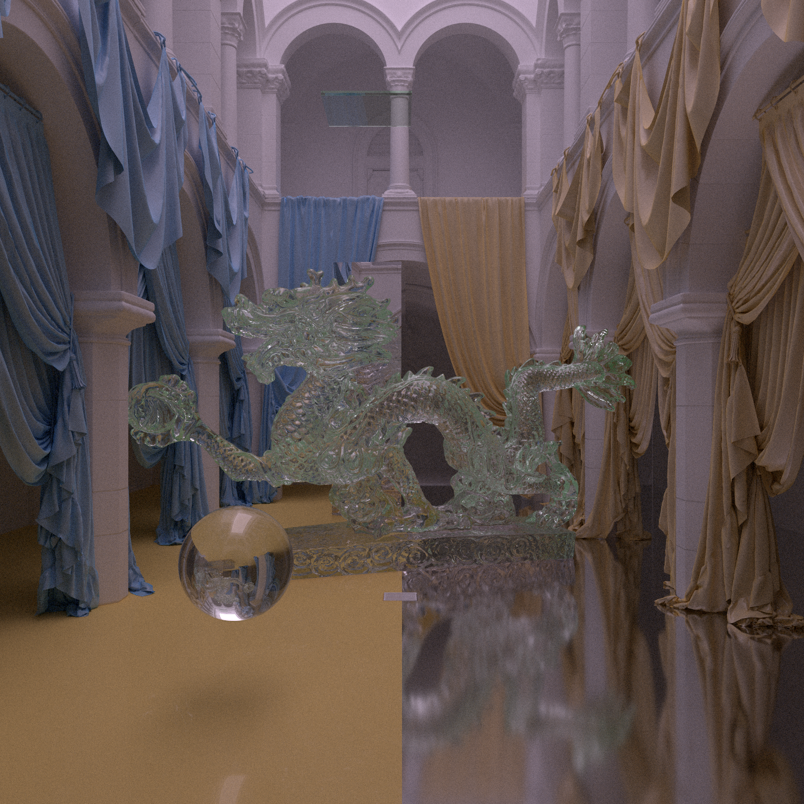

This project uses zig `0.15.2` for now



Path-traced frame.

The models in this repository are not 1:1 with those used in the final building scene.  
This is due to GitHub repository size constraints. The building and curtain models are the most affected by these limitations.

## Install
```bash
git clone --recurse-submodules https://github.com/GeorgeTerzis/vlk_raytracing.git
```
if you already cloned
```bash
git submodule update --init --recursive
```
and then
```bash
zig build
```
or 
```bash
zig build -Doptimize=ReleaseFast
```
because obj file reading can take a while


to run the program
```bash
./zig-out/bin/emma
```
## Scene
Edit the 'scene.zon' file. Rotation for now is ignored.

## Shaders
Precompiled shaders are included but just in case you can compile them yourself

To compile the shaders, you must install the Slang compiler:
https://shader-slang.org/

Shaders are located at `./src/shaders/hw_raytracing`.
Only the `main.slang` file needs to be compiled, the remaining files are modules included during compilation.
Make sure to name it shader.spv

## Platform Support
Currently, this project only targets Linux, as that is the environment it has been developed and tested on.
Windows/macOS support is not guaranteed and may require changes to Vulkan/SDL3 setup.


## References
- https://nvpro-samples.github.io/vk_raytracing_tutorial_KHR/

## Libraries Used

- [vulkan-zig](https://github.com/Snektron/vulkan-zig)
- [tinyexr](https://github.com/syoyo/tinyexr)
- [Vulkan Memory Allocator](https://github.com/GPUOpen-LibrariesAndSDKs/VulkanMemoryAllocator)
- [zig-obj](https://github.com/chip2n/zig-obj)
- [zig-sdl3](https://github.com/Gota7/zig-sdl3)
