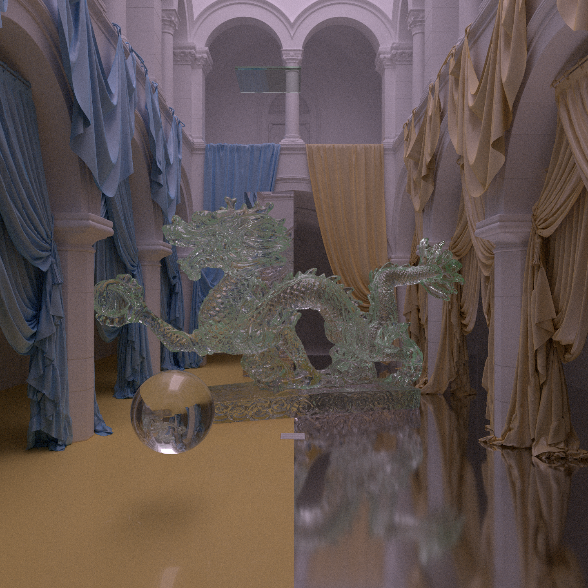

This project uses zig `0.16.0` for now

**Features**
- Path traced, physically based renderer
- Principled BSDF (diffuse, metal, glass, clearcoat)
- Next Event Estimation with area lights
- Progressive accumulation with Russian Roulette



The models in this repository are not 1:1 with those used in the final building scene.  
This is due to GitHub repository size constraints(the building model is 4GB with the curtains and decorations alone as an example).

## Install
```bash
git clone --recurse-submodules https://github.com/GeorgeTerzis/vlk_raytracing.git
```
if you already cloned
```bash
git submodule update --init --recursive
```
and then
```bash
zig build
```
or 
```bash
zig build -Doptimize=ReleaseFast
```
because obj file reading can take a while


to run the program
```bash
./zig-out/bin/emma
```
## Scene
Default scene path is `./scene.zon` which is located at the top level directory of the project.
Edit `scene.zon` to configure the scene or pass your own file.

To use your own just pass it as an arugment like this
```bash 
./zig-out/bin/emma YOUR_FILE.zon
```


you can configure the following:

**Settings**
- `resolution` output resolution
- `render_tile` dispatch chunk size

**Lights**
For now they are hard coded at `src/shaders/hw_raytracing/main.slang` see the `direct_lighting` function

**Primitives**  list of named `.obj` meshes to load.
Each primitive must be triangulated and have normals with it.

if you need just pass the model through Blender and when exporting check the triangulate faces option. UVs are not supported yet, I need to allow models to have optional attributes.

**Assets**  scene instances, each with a primitive, material index, and transform (position, scale (rotation currently ignored))

## Shaders

Compiled via `zig build shaders` step
via bash
```bash
slangc src/shaders/hw_raytracing/main.slang -o src/shaders/hw_raytracing/shader.spv
```
what the `build.zig` file uses
```zig
    const compile_shader = b.addSystemCommand(&.{
        "slangc",
        "src/shaders/hw_raytracing/main.slang",
        "-o",
        "src/shaders/hw_raytracing/shader.spv",
    });
```

Precompiled shaders are included but just in case you can compile them yourself

To compile the shaders, you must install the Slang compiler:
https://shader-slang.org/

Shaders are located at `./src/shaders/hw_raytracing`.
Only the `main.slang` file needs to be compiled, the remaining files are modules included during compilation.
Make sure to name it shader.spv

## Platform Support
Currently, this project only targets Linux, as that is the environment it has been developed and tested on.
Windows/macOS support is not guaranteed and may require changes to Vulkan/SDL3 setup.


## References
The [NVPRO Vulkan Ray Tracing Tutorials](https://nvpro-samples.github.io/vk_raytracing_tutorial_KHR/) were used as a reference while learning the Vulkan ray tracing pipeline and general setup.

## Libraries Used

### Project Dependencies

- [vulkan-zig](https://github.com/Snektron/vulkan-zig)
- [tinyexr](https://github.com/syoyo/tinyexr)
- [Vulkan Memory Allocator](https://github.com/GPUOpen-LibrariesAndSDKs/VulkanMemoryAllocator)
- [zig-obj](https://github.com/chip2n/zig-obj)
- [zig-sdl3](https://github.com/Gota7/zig-sdl3)

### External Dependencies

- Vulkan Loader / Vulkan SDK
- SDL3
- Slang Shader Compiler

### Required Vulkan Extensions

- VK_KHR_swapchain
- VK_KHR_ray_tracing_pipeline
- VK_KHR_acceleration_structure
- VK_KHR_deferred_host_operations

### Required Vulkan Features

- Ray Tracing Pipeline
- Acceleration Structures
- Buffer Device Address
- Synchronization2
- Descriptor Indexing
